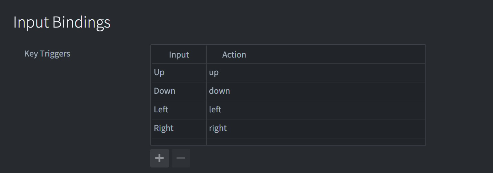

# War battles tutorial

This tutorial goes through the steps needed to create a small playable game embryo in Defold. You do not need to have any prior experience with Defold, but if you have done some programming in Lua, Javascript, Python or similar, that will help.

You start with an empty project but we have added the required assets for you. You can verify that the project is empty by [building and running it](defold://build) (or selecting <kbd>Project ▸ Build</kbd> from the menu). This will launch the game and you should see nothing but a black window.

## Draw the game map

Your game needs a setting, a map. The map that you are going to draw will be made out of tiles, small images that are put together like a mosaic into a larger image. In Defold, such an image is called a *Tile map*. In order to create a tile map, you need an image file that contains the various tiles. You then need to specify the size of the tiles, margins and padding and what image file to use in a file of a type called *Tile source*.

1. <kbd>Right click</kbd> the folder "main" and select <kbd>New ▸ Tile source</kbd>. This will create a new tile source file. Name the file "map" (full name "map.tilesource").

   

2. The new tilesource file opens automatically in the editor. Set the *Image* property of the tile source to the image file "/assets/map.png". The easiest way to do that is to click the resource selector by the *Image* property to bring up the resource selector. Then select the file "/assets/map.png":

    

    The tiles are 16⨉16 pixels in the source image with no margins or padding so there is no need to alter the default properties of the tile source.

3. <kbd>Right click</kbd> the folder "main" and select <kbd>New ▸ Tile map</kbd>. Name the file "map" (full name "map.tilemap"). The tile map is automatically opened in the editor view.

4. Set the *Tile source* property of the new tile map to "/main/map.tilesource".

5. Select "layer1" in the *Outline*.

6. Select <kbd>Edit ▸ Select Tile...</kbd>. This brings up the tile palette.

    

7. Click on a grass tile. This selects the clicked tile as the current brush. Then paint the tile map layer as you see fit with the grass tile. Select other tiles from the tile palette to paint different graphics.

8. You can hold <kbd>Shift</kbd>, then <kbd>click and drag</kbd> to make a selection on the current tile map layer. The selection then becomes your new brush. This is a useful way to paint with a brush consisting of multiple tiles.

    

When you are happy with the map, it is time to add it to the game.

## Add the map to the game

Defold stores everything you build in *collections*. A collection is a file used to build hierarchies of game objects and other collections. In the file "game.project" you specify a particular collection that is loaded when the game starts up. This is initially set to the file "/main/main.collection".

1. Open the file ["main.collection"](defold://open?path=/main/main.collection).

2. <kbd>Right click</kbd> the root node of the collection in the *Outline* and select <kbd>Add game object</kbd>.

    

3. Change the *Id* property of the game object to "map". The id does not really matter for this game object but it is a good habit to set identifiers that are descriptive---it makes it easier to find your way around when you have many game objects.

4. <kbd>Right click</kbd> the new game object and select <kbd>Add Component File</kbd>.

    

5. In the resource selector, pick the file "/main/map.tilemap". This creates a new component in the game object based on the tilemap file. The tile map should now appear in the editor view.

    

6. Run the game by selecting <kbd>Project ▸ Build</kbd> and check that everything looks good. If you feel that the window is a bit large you can open "game.project" in the project root and alter the display width and height:

    
    
NOTE: If you get an "Out of tiles to render" error when running the game it means that the tilemap you created was larger than the maximum configured number of tiles. You can solve this by increasing the [Tilemap->Max Tile Count](https://defold.com/manuals/project-settings/#max-tile-count) value in the *game.project* file.

## Create the player animation

1. <kbd>Right click</kbd> the folder "main" in the *Assets* view and select <kbd>New ▸ Atlas</kbd>. Name the new atlas file "sprites" (full name "sprites.atlas"). An atlas is a collection of images (PNG or JPEG) that are baked into a larger texture. Defold uses atlases instead of single image files for performance and memory reasons. The new atlas should open in the editor.

2. <kbd>Right click</kbd> the root node of the atlas in the *Outline* and select <kbd>Add Animation Group</kbd>.

3. Select the new animation group and change its *Id* property to "player-down".

4. <kbd>Right click</kbd> the "player-down" animation group and select <kbd>Add Images...</kbd>. In the resource selector, pick the images "/assets/infantry/down/1.png" to "/assets/infantry/down/4.png". You can type "down" in the text box to filter the selection of images.

    

5. With the animation group marked, select <kbd>View ▸ Play</kbd> from the menu to preview the animation. Press <kbd>F</kbd> to frame the animation in the editor if necessary. The animation will play back at full 60 FPS which is way too fast. Set the playback speed (*Fps* property) to 8.

    

Now you have an atlas with a single flipbook animation for the player. This is enough for initial testing---you can add more animations later. Now, let's create the player game object.

## Create the player game object

A Defold game object is an object with an id, a position, a rotation and a scale that holds components. They are used to create things like a player character, a bullet, a game's rule system or a level loader/unloader. A component, in turn, is an entity that gives a game object visual, audible and/or logic representation in the game.

1. Open "main.collection".

2. <kbd>Right click</kbd> the root node of the collection in the *Outline* and select <kbd>Add Game Object</kbd>. Set the *Id* property of the new game object to "player".

3. Change the Z *Position* property of the game object named "player" to 1.0. Since the "map" game object is at the default Z position 0 the "player" game object must be at a higher value (between -1.0 and 1.0) for it to be on top of the level.

4. <kbd>Right click</kbd> the game object "player" and select <kbd>Add Component ▸ Sprite</kbd>. This creates a new sprite component, that can show graphics, in the "player" game object.

5. Make sure that the Z *Position* of the *Sprite* is 0 so it will be rendered at the same depth as the game object "player". Setting the Z to a different value will offset the sprite depth from 1.0, which is the Z position of the game object.

6. Set the *Image* property of the sprite to "/main/sprites.atlas".

7. Set the *Default Animation* property of the sprite to "player-down".

    

8. Run the game and check that the player character is animating.

The player game object now has visual representation in the game world. The next step is to add a script component to the player game object. This will allow you to create player behavior, such as movement. But that depends on user input, so first you need to set that up.

## Add input bindings

There are no input mapped by default so you need to add input actions for your player character:

1. Open the file "/input/game.input_binding". This file contains mappings from input sources (keyboard, touch screen, game pads etc) to input *actions*. Actions are just names that we want to associate with certain input.

2. Add *Key triggers* for the four arrow keys. Name the actions "up", "down", "left" and "right".

    

## Create the player script

Unlike the sprite component, which you added directly into the "player" game object, a script component requires that you create a separate file. This script file is then used a template for the script component:

1. <kbd>Right click</kbd> the folder "main" in the *Assets* view and select <kbd>New ▸ Script</kbd>. Name the new script file "player" (full name "player.script"). The script file, pre-filled with template functions, opens up in the editor.

    

2. Open "main.collection", <kbd>Right click</kbd> the game object "player" and select <kbd>Add Component File</kbd>. Pick the new file "/main/player.script" as the file to use for the component.

You now have a script that runs in the "player" game object. It does not do anything yet though. Start by creating the logic for player movement.

## Program the player movement

The Lua code needed to create character movement in 8 directions is not long, but may require some time to understand completely. Replace the code for each of the functions in "player.script" with the code below, run the game, then take your time to carefully read through the code notes below.


```lua
function init(self)                                 -- [1]
    msg.post(".", "acquire_input_focus")            -- [2]

    self.moving = false                             -- [3]
    self.input = vmath.vector3()                    -- [4]
    self.dir = vmath.vector3(0, 1, 0)               -- [5]
    self.speed = 50                                 -- [6]
end

function final(self)                                -- [7]
    msg.post(".", "release_input_focus")            -- [8]
end

function update(self, dt)                           -- [9]
    if self.moving then
        local pos = go.get_position()               -- [10]
        pos = pos + self.dir * self.speed * dt      -- [11]
        go.set_position(pos)                        -- [12]
    end
    
    self.input.x = 0                                -- [13]
    self.input.y = 0
    self.moving = false
end

function on_input(self, action_id, action)          -- [14]
    if action_id == hash("up") then
        self.input.y = 1                            -- [15]
    elseif action_id == hash("down") then
        self.input.y = -1
    elseif action_id == hash("left") then
        self.input.x = -1
    elseif action_id == hash("right") then
        self.input.x = 1
    end
        
    if vmath.length(self.input) > 0 then
        self.moving = true                          -- [16]
        self.dir = vmath.normalize(self.input)      -- [17]
    end
end
```
1. The `init()` function is called when the script component is brought to life in the game engine. This function is useful for initial setup of the game object state.
2. This line posts a message named "acquire_input_focus" to the current game object ("." is shorthand for the current game object). This is a system message that tells the engine to send input actions to this game object. The actions will arrive in this script component's `on_input()` function.
3. `self` is a reference to the current component instance. You can store state data that is local to the component instance in `self`. You use it like a Lua table by indexing the table field variables with the dot notation. The flag variable `moving` is used to track if the player is moving or not.
4. `input` is a vector3, a vector with 3 components: `x`, `y` and `z`,  that will point in any of the current 8 input directions. It will change as the player presses the arrow keys. The Z component of this vector is unused so it is kept at value 0.
5. `dir` is another vector3 that contains the direction the player faces. The direction vector is separate from the input vector because if there is no input and the player character does not move, it should still face a direction.
6. `speed` is the movement speed expressed in pixels per second.
7. The `final()` function is called when the script component is deleted from the game. This happens either when the container game object ("player") is deleted or when the game shuts down.
8. The script explicitly releases input focus, telling the engine that it wants no more input. Input focus is automatically released when the game object is deleted so this line is not necessary but is included here for clarity.
9. The `update()` function is called once each frame. The game is running at 60 frames per second so the function is called at an interval of 1/60 seconds. The argument variable `dt` contains the current frame interval---the number of seconds elapsed since the last call to the function.
10. If the `moving` flag is true, get the current game object position. The function `go.get_position()` takes an optional argument which is the id of the game object to get the position of. If no argument is given, the current game object's position is returned.
11. Add the current direction vector (scaled to speed and frame interval) to the position.
12. Set the position of the game object to the new position.
13. After the calculations have been made, set the input vector to 0 and unset the `moving` flag.
14. The `on_input()` function is called every frame for all mapped input that is active. The argument `action_id` contain the action as set up in the input bindings file. The argument `action` is a Lua table with details on the input.
15. For each input direction, set the X or the Y component of the `input` vector in `self`. If the user presses the <kbd>up arrow</kbd> and <kbd>left arrow</kbd> keys simultaneously, the engine will call this function twice and the input vector will end up being set to `(-1, 1, 0)`.
16. If the user presses any of the arrow keys, the input vector length will be non zero. If so, set the `moving` flag so the player will be moved in `update()`. The reason the script does not move the player in the `on_input()` function is that it is simpler to collect all input each frame and then act upon it in `update()`.
17. The `dir` direction vector is set to the normalized value of the input. If the input vector is `(1, 1, 0)`, for instance, the vector length is greater than 1 (the square root of 2). Normalizing the vector brings it to a length of exactly 1. Without normalization diagonal movement would be faster than horizontal and vertical. When the engine runs the `update()` function, any user input will have an effect on the `dir` vector which will cause the player to move.

With the code above, your game now has a player character that can move around on the screen. Next, let's add the possibility to fire rockets.

## Create a rocket game object

Rockets should work like this: whenever the user presses a key, a rocket should fire. It should be possible to fire any number of rockets. To solve that you cannot just add a rocket game object to "main.collection"---that would be only one single rocket object. Instead, what you need to is a *blueprint* for a rocket game object and then a *factory* that creates new game objects on the fly based on that blueprint.

Start by creating the game object blueprint file:

1. <kbd>Right click</kbd> the folder "main" in the *Assets* view and select <kbd>New ▸ Game Object</kbd>. Name this file "rocket" (full name "rocket.go").

2. Open "sprites.atlas" and create a new animation group (right click the root node and select <kbd>Add Animation Group</kbd>). Name the animation "rocket".

3. Add the three rocket images (in "/assets/buildings/turret-rocket") to the animation group and set the *Fps* property to a value that makes the animation look good when you preview.

    

4. Open "rocket.go" and <kbd>Right click</kbd> the root in the *Outline* and select <kbd>Add Component ▸ Sprite</kbd>.

5. Set the *Image* property of the sprite to "/main/sprites.atlas" and the *Default Animation* to "rocket".

Now you have a basic rocket game object blueprint, on file. The next step is to add functionality to spawn game objects based on this blueprint file. For that, you will use a *Factory* component. You also need to add a new input action for the firing mechanic.

## Spawn rockets

1. Open "main.collection" and <kbd>Right click</kbd> on the "player" game object. Select <kbd>Add Component ▸ Factory</kbd>.

2. Select the new factory component and set its *Id* property to "rocketfactory" and its *Prototype* to the file "/main/rocket.go" (the one you created above). Now the player game object is all set.

3. Open the file "/input/game.input_binding".

4. Add a *Key trigger* for the firing action. Call this action "fire".

    

5. Open "main/player.script" and add a flag to track if the player is firing to the `init()` function:

    ```lua
    function init(self)
        msg.post(".", "acquire_input_focus")
    
        self.moving = false
        self.firing = false                     -- [1]
        
        self.input = vmath.vector3()
        self.dir = vmath.vector3(0, 1, 0)
        self.speed = 50
    end
    ```
    1. Whenever the player is firing this value will be set to `true`.

6. In `update()`, add what should happen when the flag is set: the factory component should create a new game object instance:

    ```lua
    function update(self, dt)
        if self.moving then
            local pos = go.get_position()
            pos = pos + self.dir * self.speed * dt
            go.set_position(pos)
        end
        
        if self.firing then
            factory.create("#rocketfactory")    -- [1]
        end
        
        self.input.x = 0
        self.input.y = 0
        
        self.moving = false
        self.firing = false                     -- [2]
    end
    ```
    1. If the `firing` flag is true, tell the factory component called "rocketfactory" that you just created to spawn a new game object. Note the character '#' that indicates that what follows is the id of a component.
    2. Set the firing flag to false. This flag will be set in `on_input()` each frame the player presses the fire key.

7. Scroll down to the `on_input()` function. Add a fifth `elseif` for the case where the function is called with the "fire" action and only the one frame when the key is pressed down:

    ```lua
        ...
        elseif action_id == hash("right") then
            self.input.x = 1
        elseif action_id == hash("fire") and action.pressed then
            self.firing = true
        end
        ...
    ```

If you run the game now you should be able to move around and drop rockets all over the map by hammering the fire key. This is a good start.

## Set the direction of the rocket

When a rocket is spawned, it is currently not oriented in the player's direction. That needs to be fixed. It should also fly straight ahead and explode after a short interval:

1. Open "player.script" and scroll down to the `update()` function and update its code:

    ```lua
    function update(self, dt)
        if self.moving then
            local pos = go.get_position()
            pos = pos + self.dir * self.speed * dt
            go.set_position(pos)
        end
        
        if self.firing then
            local angle = math.atan2(self.dir.y, self.dir.x)    -- [1]
            local rot = vmath.quat_rotation_z(angle)            -- [2]
            local props = { dir = self.dir }                    -- [3]
            factory.create("#rocketfactory", nil, rot, props)   -- [4]
        end
        ...
    ```
    1. Compute the angle (in radians) of the player.
    2. Create a quaternion for that angular rotation around Z.
    3. Create a table containing property values to pass to the rocket. The player's direction is the only data the rocket needs.
    4. Add explicit position (`nil`, the rocket will spawn at the player's position), rotation (the calculated quaternion) and spawn property values.

    Note that the rocket needs a movement direction in addition to the game object rotation (`rot`). It would be possible to make the rocket calculate its movement vector based on its rotation, but it is easier and more flexible to separate the two values. For instance, with a separate rotation it is possible to add rotation wobble to the rocket without it affecting the movement direction.

2.  <kbd>Right click</kbd> the folder "main" in the *Assets* view and select <kbd>New ▸ Script</kbd>. Name the new script file "rocket" (full name "rocket.script"). Replace the template code in the file with the following:

    ```lua
    go.property("dir", vmath.vector3())                 -- [1]
    
    function init(self)
        self.speed = 200                                -- [2]
    end
    
    function update(self, dt)
        local pos = go.get_position()                   -- [3]
        pos = pos + self.dir * self.speed * dt          -- [4]
        go.set_position(pos)                            -- [5]
    end
    ```
    1. Define a new script property named `dir` and initialize the property with a default empty vector (`vmath.vector3()`). The default value can be overrided by passing values to the `factory.create()` function. The current property value is accessed as `self.dir`. This is expected to be a unit vector (of length 1).
    2. A rocket speed value, expressed in pixels per second.
    3. Get the current rocket position.
    4. Calculate a new position based on the old position, the movement direction and the speed.
    5. Set the new position.

3. Open "rocket.go" and <kbd>Right click</kbd> the root in the *Outline* and select <kbd>Add Component File</kbd>. Select the file "rocket.script" as basis for the component.

4. Run the game and try the new mechanic. Notice that the rockets fly in the right direction but they are oriented 180 degrees wrong. That's an easy fix.

    

5. Open "sprites.atlas", select the "rocket" animation and click the *Flip horizontal* property.

    

6. Run the game again to verify that everything looks ok.

    

## Make the rockets explode

The rockets should explode a short while after they are fired:

1. Open "sprites.atlas" and create a new animation group (right click the root node and select <kbd>Add Animation Group</kbd>). Call the animation "explosion".

2. Add the nine explosion images in "/assets/fx/explosion" to the animation group and set the *Fps* property to a value that makes the animation look good when you preview. Also make sure that this animation has the *Playback* property set to `Once Forward`.

    

3. Open "rocket.script" and scroll down to the `init()` function and change it to:

    ```lua
    function init(self)
        self.speed = 200
        self.life = 1                               -- [1]
    end
    ```
    1. This value will act as a timer to track the lifetime of the rocket.

4. Scroll down to the `update()` function and change it to:

    ```lua
    function update(self, dt)
        local pos = go.get_position()
        pos = pos + self.dir * self.speed * dt
        go.set_position(pos)
        
        self.life = self.life - dt                              -- [1]
        if self.life < 0 then                                   -- [2]
            self.life = 1000                                    -- [3]
            go.set_rotation(vmath.quat())                       -- [4]
            self.speed = 0                                      -- [5]
            sprite.play_flipbook("#sprite", "explosion")        -- [6]
        end
    end
    ```
    1. Decrease the life timer with delta time. It will decrease with 1.0 per second.
    2. When the life timer has reached zero.
    3. Set the life timer to a large value so this code won't run every subsequent update.
    4. Set the game object rotation to 0, otherwise the explosion graphics will be rotated.
    5. Set the movement speed to 0, otherwise the explosion graphics will move.
    6. Play the "explosion" animation on the game object's "sprite" component.

5. Below the `update()` function, add a new `on_message()` function:

    ```lua
    function on_message(self, message_id, message, sender)      -- [1]
        if message_id == hash("animation_done") then            -- [2]
            go.delete()                                         -- [3]
        end 
    end
    ```
    1. The function `on_message()` gets called whenever a message is posted to this script component.
    2. Check if the message posted has the hashed name (or id) "animation_done". The engine runtime sends this message whenever a sprite animation initiated with `sprite.play_flipbook()` from this script has completed.
    3. When the animation is done, delete the current game object.

Run the game.


This is definitely getting somewhere! Now you just need something to fire the rockets at!

## Create a tank game object

1. <kbd>Right click</kbd> the folder "main" in the *Assets* view and select <kbd>New ▸ Game Object</kbd>. Name this file "tank" (full name "tank.go"). Like the rocket game object, this is a file that can be used as a *blueprint* when creating actual tank game objects.

2. Open "sprites.atlas" and create a new animation group (right click the root node and select <kbd>Add Animation Group</kbd>). Name the animation "tank-down".

3. Add the two downwards facing images in "/assets/units/tank/down" to the animation and set its *Fps* value to something that looks good.

    

4. Open "tank.go" and <kbd>Right click</kbd> the root in the *Outline* and select <kbd>Add Component ▸ Sprite</kbd>.

5. Set the *Image* property of the sprite to "/main/sprites.atlas" and the *Default animation* to "tank-down".

6. Open "main.collection".

7. <kbd>Right click</kbd> the root node of the collection in the *Outline* and select <kbd>Add Game Object File</kbd>. Select "tank.go" as blueprint for the new game object.

8. Create a few more tanks from the blueprint. Position them on the map with the *Move Tool*. Make sure to set the Z position to 1.0 so they are all rendered on top of the map.

    

Run the game and check that the tanks look okay.

## Add collision objects

When you fire at the tanks, the rockets currently fly straight through them. The next step is to add collision between the tanks and the rockets:

1. Open "tank.go" and <kbd>Right click</kbd> the root in the *Outline* and select <kbd>Add Component ▸ Collision Object</kbd>.

2. Set the *Type* property to "Kinematic". This means that the physics engine will not simulate any gravity or collision on this object. Instead it will only detect and signal collisions and leave it to you to code the response.

3. Set the *Group* property to "tanks" and *Mask* to "rockets". This causes this game object to detect collisions against object in the group "rockets" that has the mask set to "tanks".

4. <kbd>Right click</kbd> the "collisionobject" component in the *Outline* and select <kbd>Add Shape ▸ Box</kbd>. Set the size of the box shape to match the tank graphics.

    

6. Open "rocket.go" and <kbd>Right click</kbd> the root in the *Outline* and select <kbd>Add Component ▸ Collision Object</kbd>.

7. Set the *Type* property to "Kinematic".

8. Set the *Group* property to "rockets" and *Mask* to "tanks". This causes this game object to detect collisions against object in the group "tanks" that has the mask set to "rockets".

    Now the group and mask between rockets and tanks match each other so the physics engine will detect when they interact.

9. Right click the "collisionobject" component in the Outline and select Add Shape ▸ Box. Set the size of the box shape to match the rocket graphics.

    

The physics engine sends messages to game objects that collide. The last piece of the puzzle is to add code that reacts to those messages.

## Code a reaction to the collisions

1. Open "rocket.script" and scroll down to the `update()` function. There are a couple of things to do here:

    ```lua
    local function explode(self)                                -- [1]
        self.life = 1000
        go.set_rotation(vmath.quat())
        self.speed = 0
        sprite.play_flipbook("#sprite", "explosion")       
    end
    
    function update(self, dt)
        local pos = go.get_position()
        pos = pos + self.dir * self.speed * dt
        go.set_position(pos)
        
        self.life = self.life - dt
        if self.life < 0 then
            explode(self)                                       -- [2]
        end
    end
    
    function on_message(self, message_id, message, sender)
        if message_id == hash("animation_done") then
            go.delete()
        elseif message_id == hash("collision_response") then    -- [3]
            explode(self)                                       -- [4]
            go.delete(message.other_id)                         -- [5]
        end
    end
    ```
    1. Since you want the rocket to explode either when the timer runs out (in `update()`) or when the rocket hits a tank (in `on_message()`) you should break out that piece of code to avoid duplication. In this case that is done with a local function. The function is declared `local`, meaning that it only exist within the scope of the rocket script. Lua's scoping rules says that local functions need to be declared before they are used. Therefore the function is placed above `update()`. Also make sure to pass `self` as a parameter to the function so you can access `self.life` etc.
    2. The code that used to live here has been moved to the `explode()` function.
    3. The engine sends a message called "collision_response" when the shapes collide, if the group and mask pairing is correct.
    4. Call the `explode()` function if there is a collision.
    5. Finally delete the tank. You get the id of the game object the rocket collided with through the `message.other_id` variable.

Run the game and destroy some tanks! The tanks aren't very interesting enemies, but they should nevertheless give you some score.

## Create the scoring GUI

1. <kbd>Right click</kbd> the folder "main" in the *Assets* view and select <kbd>New ▸ Font</kbd>. Name this file "text" (full name "text.font").

2. Open "text.font" and set the *Font* property to the file "/assets/fonts/04font.ttf".

    

3. <kbd>Right click</kbd> the folder "main" in the *Assets* view and select <kbd>New ▸ Gui</kbd>. Name this file "ui" (full name "ui.gui"). It will contain the user interface where you will place the score counter.

4. Open "ui.gui". <kbd>Right click</kbd> *Fonts* in the *Outline* view and select <kbd>Add ▸ Fonts</kbd>. Select the "/main/text.font" file.

5. <kbd>Right click</kbd> *Nodes* in the *Outline* view and select <kbd>Add ▸ Text</kbd>.

6. Select the new text node in the outline and set its *Id* property to "score", its *Text* property to "SCORE: 0", its *Font* property to the font "text" and its *Pivot* property to "West".

7. Place the text node in the top left corner of the screen.

    

8. <kbd>Right click</kbd> the folder "main" in the *Assets* view and select <kbd>New ▸ Gui Script</kbd>. Name this new file "ui" (full name "ui.gui_script").

9. Go back to "ui.gui" and select the root node in the *Outline*. Set the *Script* property to the file "/main/ui.gui_script" that you just created. Now if we add this Gui as a component to a game object the Gui will be displayed and the script will run.

10. Open "main.collection".

11. <kbd>Right click</kbd> the root node of the collection in the *Outline* and select <kbd>Add Game Object</kbd>.

12. Set the *Id* property of the game object to "gui", then <kbd>Right click</kbd> it and select <kbd>Add Component File</kbd>. Select the file "/main/ui.gui". The new component will automatically get the *Id* "ui".

    

Now the score counter is displayed. You only need to add functionality in the Gui script so the score can be updated.

## Code the scoring update

1. Open "ui.gui_script".

2. Replace the template code with the following:

    ```lua
    function init(self)
        self.score = 0                                          -- [1]
    end
    
    function on_message(self, message_id, message, sender)
        if message_id == hash("add_score") then                 -- [2]
            self.score = self.score + message.score             -- [3]
            local scorenode = gui.get_node("score")             -- [4]
            gui.set_text(scorenode, "SCORE: " .. self.score)    -- [5]
        end 
    end
    ```
    1. Store the current score in `self`. Start from 0.
    2. Reaction to a message named "add_score".
    3. Increase the current score value in `self` with the value passed in the message.
    4. Get hold of the text node named "score" that you created in the Gui.
    5. Update the text of the node to the string "SCORE: " and the current score value concatenated to the end of the string.

3. Open "rocket.script" and scroll down to the `on_message()` function where you need to add one new line of code:

    ```lua
    function on_message(self, message_id, message, sender)
        if message_id == hash("animation_done") then
            go.delete()
        elseif message_id == hash("collision_response") then
            explode(self)
            go.delete(message.other_id)
            msg.post("/gui#ui", "add_score", {score = 100})     -- [1]
        end
    end
    ```
    1. Post a message named "add_score" to the component "ui" in the game object named "gui" at the root of the main collection. Pass along a table where the field `score` has been set to 100.

4. Try the game!


There you go! Well done!

## What next?

We hope you enjoyed this tutorial and that it was helpful. To get to know Defold better, we suggest that you to continue working with this little game. Here are a few suggested exercises:

1. Add directional animations for the player character. Tip, add a function called `update_animation(self)` to the `update()` function and change the animation depending on the value of the `self.dir` vector. It is also worth remembering that if you call `sprite.play_flipbook()` on a sprite, the animation will restart from the beginning, each frame---so you should only call `sprite.play_flipbook()` when the animation should change.

2. Add an "idle" state to the player character so it only plays a walking animation when moving.

3. Make the tanks spawn dynamically. Look at how the rockets are spawned and do a similar setup for the tanks. You might want to create a new game object in the main collection with a script that controls the tank spawning.

4. Make the tanks patrol the map. One simple option is to have the tank pick a random point on the map and move towards that point. When it is within a short distance of the point, it picks a new point.

5. Make the tanks chase the player. One option is to add a new collision object to the tank with a spherical shape. If the player collides with the collision object, have the tank drive towards the player.

6. Make the tanks fire at the player.

7. Add sound effects.


Check out the [documentation pages](https://defold.com/learn) for examples, tutorials, manuals and API docs.

If you run into trouble, help is available in [our forum](https://forum.defold.com).

Happy Defolding!

---
